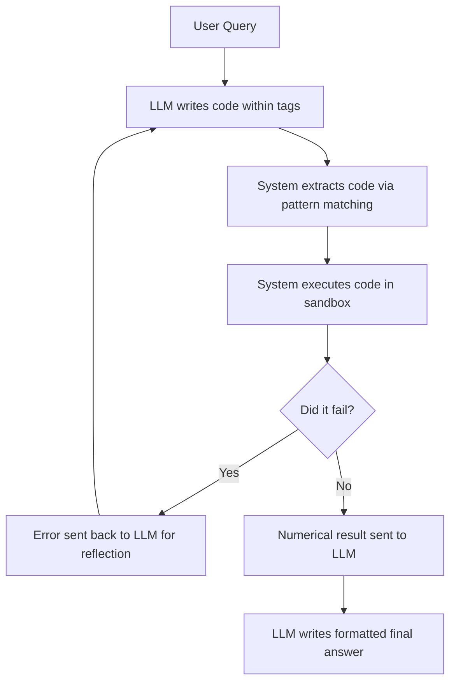

## Context

This source is a transcript of a presentation about adding code execution capabilities to Large Language Model (LLM) applications. The speaker explains why allowing an LLM to write and run its own code is more efficient than building individual tools for every possible task.

## Key takeaways

* Code execution allows LLMs to solve complex problems without needing a predefined tool for every operation.
* Using a specific prompt with delimiters helps the system extract code from the LLM response.
* The system can improve accuracy by passing execution errors back to the LLM for revision.
* Running arbitrary LLM code is risky and can lead to accidental data deletion.
* Sandbox environments are the best practice for mitigating security risks.
* The Model Context Protocol (MCP) is a new standard to help developers share and access LLM tools.

## Core concepts

* **Code Execution**: The ability of an LLM to write a script (e.g., Python) to solve a problem and then run that script to get a result. This replaces the need for manual tool creation.
* **Sandboxing**: Running code in an isolated environment. This prevents the code from accessing or damaging the main system or sensitive data.
* **Reflection**: A process where the LLM receives an error message from a failed code execution and uses that feedback to rewrite and correct the code.

## How it works

The process of integrating code execution follows this sequence:

## Facts and numbers

| Item | Detail | Context |
| :--- | :--- | :--- |
| Language | Python | The primary language used in the examples. |
| Tool | `exec` function | A built-in Python function that executes passed code. |
| Sandbox Tools | Docker, E2B | Examples of environments used to reduce risk. |
| Protocol | MCP | Model Context Protocol for accessing LLM tools. |

## Examples

* **Math Word Problems**: Instead of building separate tools for addition, subtraction, and square roots, the LLM writes a Python script to calculate the square root of two.
* **Accidental Deletion**: A team member used an agentic coder that accidentally executed a command to remove all `.py` files in a project directory.

## Practical lessons

* **Prompting for code**: Instruct the LLM to delimit code with specific tags (e.g., `execute Python` and `closing execute Python`) to make extraction easier.
* **Extraction method**: Use regular expressions or pattern matching to isolate the code from the text response.
* **Risk mitigation**: Do not run arbitrary LLM code on a primary system. Use a sandbox like Docker or E2B to prevent data loss or leakage.
* **Error handling**: Implement a loop where the LLM can see execution errors and try again to increase accuracy.

## Connections

* **Code Execution vs. Individual Tools**: Code execution solves the problem of "tool sprawl" where a developer would otherwise have to create a tool for every button on a scientific calculator.
* **Sandboxing vs. `exec`**: Using the `exec` function is powerful but risky; sandboxing is the trade-off that provides safety at the cost of additional setup.
* **Reflection vs. Accuracy**: Reflection allows the LLM to correct its own mistakes, which leads to more accurate final answers.

## Terms to remember

* **Agentic application**: An application where the LLM can take autonomous actions, such as writing and running code.
* **Regular expression**: A sequence of characters used to find specific patterns in text.
* **MCP**: Model Context Protocol, a standard for providing tools to LLMs.

## Memory check

1. Why is code execution preferred over creating individual tools for math?
2. How does a system identify which part of an LLM response is code?
3. What is the purpose of passing an error message back to the LLM?
4. What is a specific danger of running arbitrary LLM code?
5. Which two sandbox environments are mentioned as best practices?
6. What is the Model Context Protocol (MCP)?

**Answer Key**
1. It avoids the need to build a separate tool for every possible operation (like every button on a calculator).
2. By using pattern matching or regular expressions to find specific delimiters/tags.
3. To allow the LLM to reflect on the mistake and revise the code for a correct answer.
4. It can accidentally delete files or leak sensitive data.
5. Docker and E2B.
6. A new standard that makes it easier for developers to access a large set of tools for LLMs.

## What is unclear or missing

* **[Unclear]** The speaker mentions "some security implications which we'll see later in this video," but the provided transcript does not include the detailed security breakdown beyond the mention of sandboxing.

## One-minute refresh

* LLMs can write and execute code to solve complex tasks more flexibly than using predefined tools.
* Use delimiters in prompts and regular expressions to extract the code.
* Use a reflection loop to let the LLM fix its own code errors.
* **Always** run LLM-generated code in a sandbox (e.g., Docker, E2B) to avoid system damage or data loss.
* The Model Context Protocol (MCP) is the emerging standard for sharing LLM tools.
