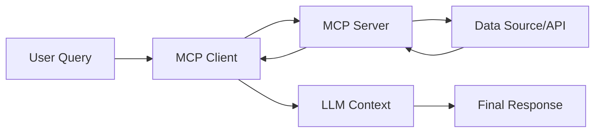

## Context

This source is a video transcript explaining the Model Context Protocol (MCP). The speaker introduces MCP as a standard for giving Large Language Models (LLMs) access to external data and tools. The primary goal is to eliminate the need for developers to write redundant custom integrations for every data source.

## Key takeaways

* MCP is a standard proposed by Anthropic to connect LLMs to context and tools.
* It replaces the need for custom "wrappers" for every single API integration.
* It reduces community effort from a multiplicative scale (M applications times N tools) to an additive scale (M plus N).
* The protocol supports both data retrieval and the execution of functions.
* The ecosystem consists of MCP clients (applications) and MCP servers (service wrappers).

## Core concepts

* **MCP Client**: An application that consumes tools or resources. It acts as the interface that requests data or actions.
* **MCP Server**: A software wrapper that provides access to a specific tool or data source (e.g., GitHub, Slack). It translates client requests into API calls the source understands.
* **Resources**: A term used in MCP documentation to describe tools that specifically fetch data to provide context to an LLM.

## How it works

MCP acts as a standardized bridge between an application and a data source.

## Examples

* **GitHub Integration**: A cloud desktop app (client) connects to a GitHub MCP server.
    * **Resource fetch**: The user asks to summarize a `readme.markdown` file. The client requests the file from the server, which fetches it from GitHub and feeds it into the LLM context.
    * **Tool use**: The user asks for the latest pull requests. The client uses the server's "list pull requests" tool to retrieve a list of 20 items, which the LLM then summarizes.

## Practical lessons

* **Build to the standard**: Developers should build their applications as MCP clients to easily access a growing list of existing MCP servers.
* **Provide resources**: Developers who want to share their data sources with other developers should build an MCP server.

## Connections

* **Efficiency**: MCP solves the problem of redundant development. Instead of every app building its own Slack integration, one MCP server for Slack serves all MCP clients.
* **Context vs. Action**: Resources provide context (fetching data), while tools allow for more general functions (taking actions).

## Terms to remember

* **MCP**: Model Context Protocol.
* **Wrapper**: Code written around an API to make it usable by a specific application.
* **Agentic applications**: Applications that use tools to perform tasks autonomously.

## Memory check

1. Who originally proposed the Model Context Protocol?
2. What is the difference between an MCP client and an MCP server?
3. How does MCP change the amount of work required by the developer community (mathematically)?
4. In MCP terminology, what are "resources"?
5. If an application wants to access data from Google Drive using MCP, what component must be built to handle the Google Drive API?

**Answer key**
1. Anthropic.
2. A client consumes tools/resources; a server provides them.
3. It changes the work from $M \times N$ (multiplicative) to $M + N$ (additive).
4. Tools that fetch data to provide context to an LLM.
5. An MCP server.

## What is unclear or missing

**[Unclear]** The speaker mentions "service" and "MCP service" interchangeably with "MCP server." It is unclear if "service" refers to the same architectural component as the "server."

## One-minute refresh

* MCP is a standard for LLM tool and data integration.
* It stops developers from writing the same API wrappers repeatedly.
* **Clients** request data; **Servers** provide it.
* It supports both **Resources** (fetching data) and **Tools** (functions).
* It turns the integration effort from $M \times N$ into $M + N$.
